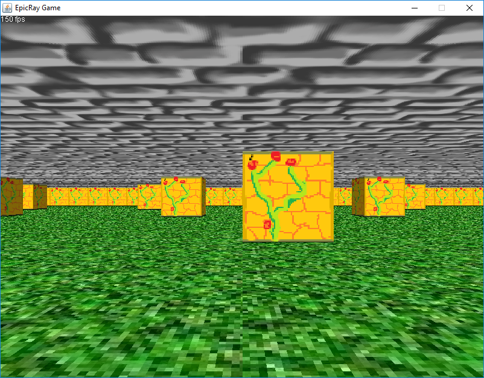

EpicRay
=======

*Archived, badly documented, buggy and untested, but fun and well-optimized "Modern Raycasting Engine in Java"*

I abandoned this project, but if you are interested in working on it, please do open a pullrequest.

This is a "true" raycasting engine. What that is supposed to mean is that the rendering code
actually uses raycasting techniques and doesn't just try to immitate the look. An editor
comes along in the code aswell.

Find more screenshots [here](https://github.com/Squareys/epic-ray-engine/tree/master/imgs)

# Building

This repository contains two [Eclipse](https://www.eclipse.org/downloads/) projects.
There are no further dependencies, it should "just work".

Simply open Eclipse, right-click in the "Package Explorer", "Import" > "Existing Projects into Workspace",
then select the repository root directory and hit "Finish".

# Launching

In Eclipse, right-click "EpicRay" or "EpicRayEditor" and "Run As..." > "Java Application".

A example map file can be found under `EpicRayEditor/file.dat`. You should resize the Window after loading it,
it looks like there is a bug which doesn't force the redraw.

# Getting Started

`main(...)` is in `de.squareys.epicray.engine.Main`.

`de.squareys.epicray.engine.EpicRayRenderer` generates `EpicRayRay`s, which are the
"work unit" for the thread pool.

I hope you can work from there.

# Features

The current features are implemented at the moment
- Engine:
  - Wall rendering: textured or single color
  - Floor/Ceiling Rendering: textured or single color
  - Keyboard movement and world collision
  - zBuffer (makes way for fog and masked texture implementation)
  - Threaded Rendering
- Editor:
  - Basic tilemap editor
  - Basic tilecreator/editor
  - Loading and saving
  - Play the game directly in the editor! :)

# Todos

Here are some todos you could do, if you are thinking of contributing:
- Engine:
  - Sprite Rendering
  - Player spawn
  - Mouse movement
  - Postprocessing framework and effects (fog, dof, ...)
  - Background image
  - Lighting, maybe?
- Editor:
  - Resource manager dialog for textures and other assets
  - Player spawn
  - Background image
  - Better data/functionality/gui separation

# Licence

The code of this project is licensed under the MIT/Expat license:

~~~
Copyright © 2018 Jonathan Hale <squareys@googlemail.com>

Permission is hereby granted, free of charge, to any person obtaining a
copy of this software and associated documentation files (the "Software"),
to deal in the Software without restriction, including without limitation
the rights to use, copy, modify, merge, publish, distribute, sublicense,
and/or sell copies of the Software, and to permit persons to whom the
Software is furnished to do so, subject to the following conditions:

The above copyright notice and this permission notice shall be included
in all copies or substantial portions of the Software.

THE SOFTWARE IS PROVIDED "AS IS", WITHOUT WARRANTY OF ANY KIND, EXPRESS OR
IMPLIED, INCLUDING BUT NOT LIMITED TO THE WARRANTIES OF MERCHANTABILITY,
FITNESS FOR A PARTICULAR PURPOSE AND NONINFRINGEMENT. IN NO EVENT SHALL
THE AUTHORS OR COPYRIGHT HOLDERS BE LIABLE FOR ANY CLAIM, DAMAGES OR OTHER
LIABILITY, WHETHER IN AN ACTION OF CONTRACT, TORT OR OTHERWISE, ARISING
FROM, OUT OF OR IN CONNECTION WITH THE SOFTWARE OR THE USE OR OTHER
DEALINGS IN THE SOFTWARE.
~~~
